## Matti Kähkönen

<table >
  <tr>
    <td align="left" valign="top">
      Hello, I'm a Computer Science Master's student in the Algorithms-track in University of Helsinki.
    </td>
    <td align="center">
      

---

  </td>
  </tr>

</table>

<!--
**mfk99/mfk99** is a ✨ _special_ ✨ repository because its `README.md` (this file) appears on your GitHub profile.

Here are some ideas to get you started:

- 🔭 I’m currently working on ...
- 🌱 I’m currently learning ...
- 👯 I’m looking to collaborate on ...
- 🤔 I’m looking for help with ...
- 💬 Ask me about ...
- 📫 How to reach me: ...
- 😄 Pronouns: ...
- ⚡ Fun fact: ...
-->
